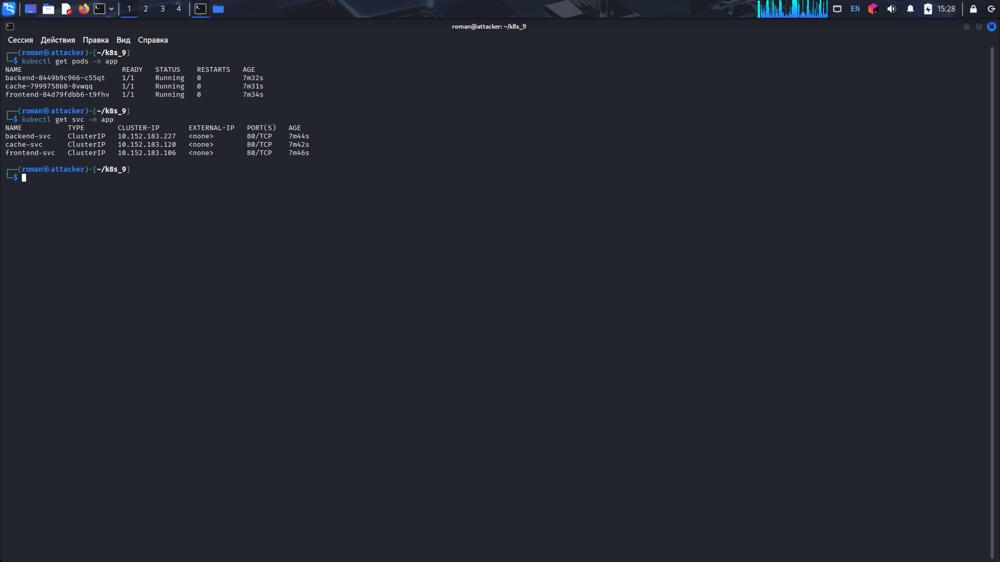
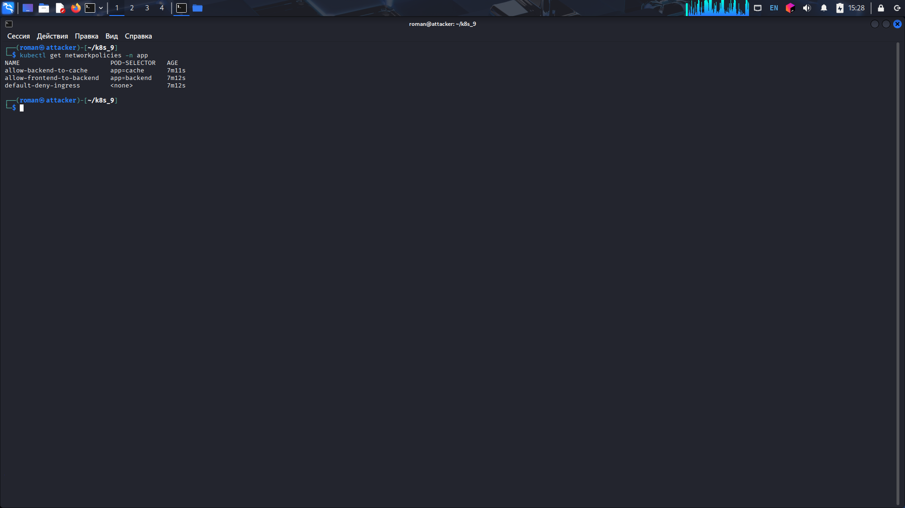
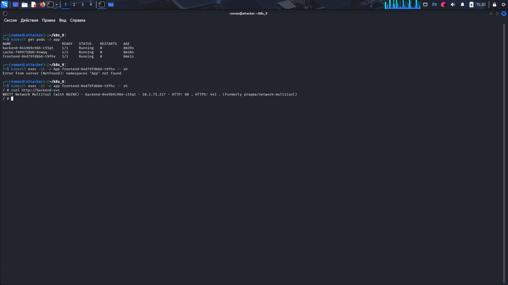
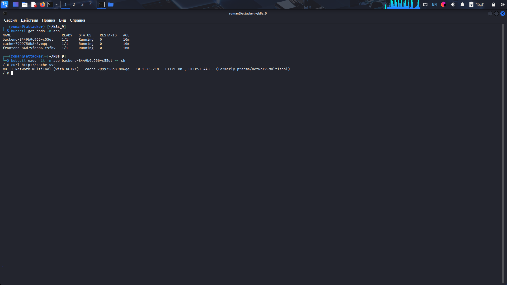
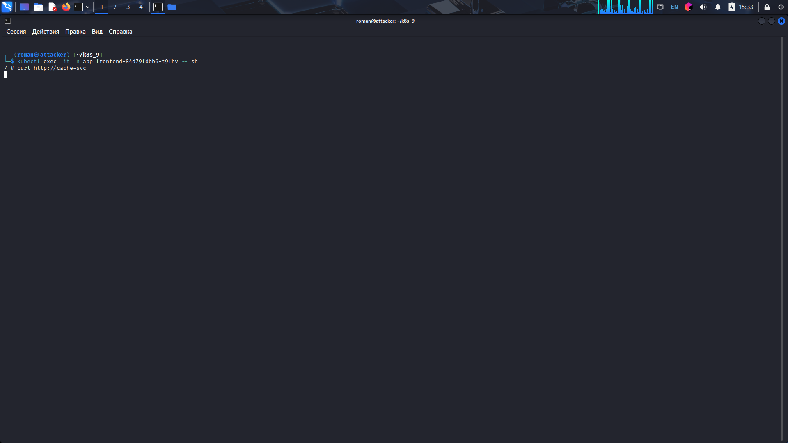
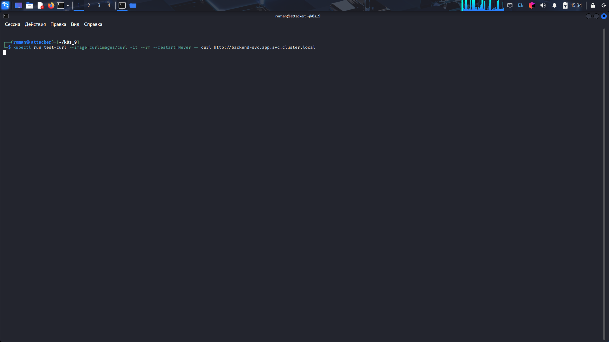
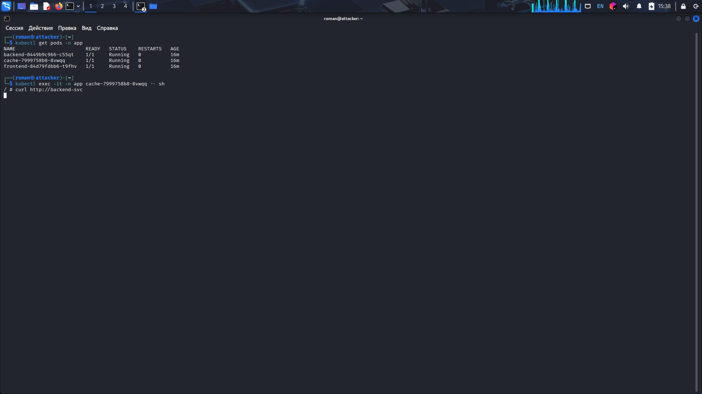
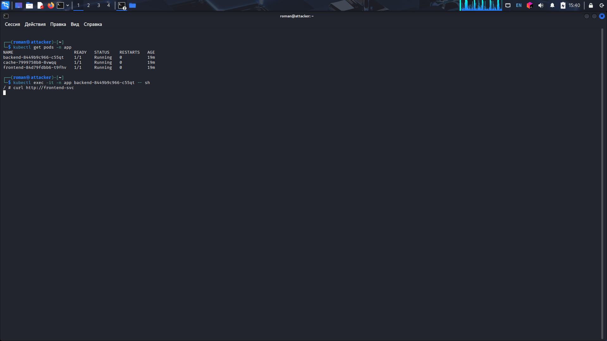

# Домашнее задание: Сетевая политика в Kubernetes (Calico)

## Выполнил - Машаев Роман

**Цель:**  
Настроить сетевую политику (Network Policy) для изоляции трафика между подами `frontend`, `backend` и `cache` в namespace `app`.  
Разрешить только цепочку `frontend → backend → cache`, все остальные подключения запретить.

## Предварительные требования

- Кластер Kubernetes с установленным сетевым плагином **Calico**.
- Утилита `kubectl`.
- Базовые знания Kubernetes.

## Файлы манифестов

Все манифесты лежат в папке `manifests/`:

- [`namespace.yaml`](./manifests/namespace.yaml) – создание namespace `app`
- [`deployments.yaml`](./manifests/deployments.yaml) – deployment'ы и сервисы для frontend, backend, cache
- [`policies.yaml`](./manifests/policies.yaml) – сетевые политики

## Выполнение задания (скриншоты выполнения)

1. **Поды и сервисы**  
   

2. **Сетевые политики**  
   

3. **frontend → backend (разрешено)**  
   

4. **backend → cache (разрешено)**  
   

5. **frontend → cache (заблокировано, завис)**  
   

6. **Доступ из namespace default (заблокирован,завис)**  
   

7. **cache → backend (заблокировано,завис)**  
   

8. **backend → frontend (заблокировано, завис)**  
   

